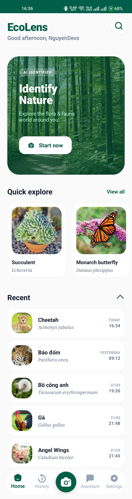
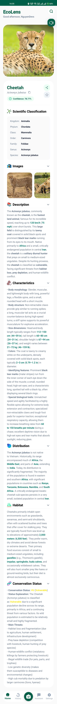
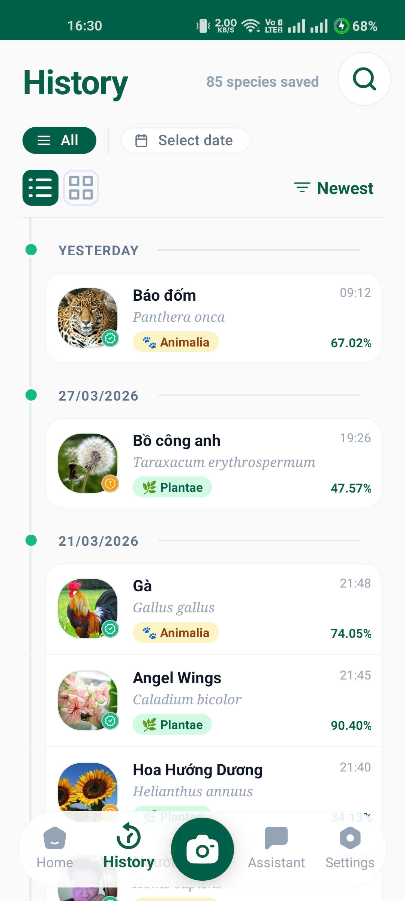
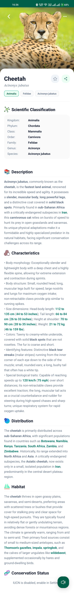
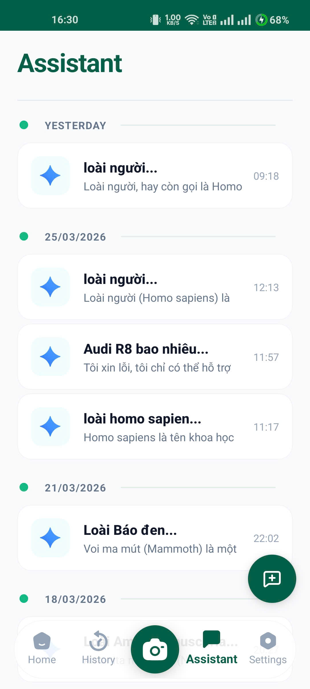
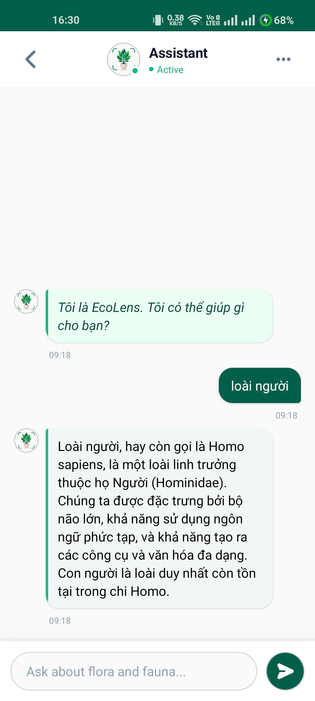
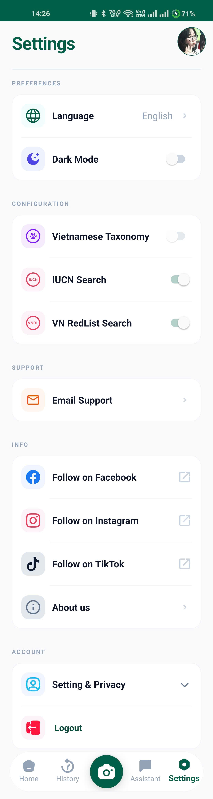

# EcoLens

[](https://kotlinlang.org/)
[](https://m3.material.io/)
[](https://deepmind.google/technologies/gemini/)
[](https://workers.cloudflare.com/)
[](https://firebase.google.com/)
[](LICENSE)

EcoLens is an industry-grade Android ecosystem that bridges the gap between high-performance artificial intelligence and conservation science. By orchestrating a network of global biodiversity databases and generative models through a high-security infrastructure, the platform empowers users to identify, document, and study species with professional accuracy.

---

## Intelligence and Data Ecosystem

EcoLens orchestrates a sophisticated biodiversity intelligence network that begins with the **iNaturalist API**, which processes visual patterns and geographical coordinates to provide high-confidence species matches. This initial identification is instantly validated against the **GBIF (Global Biodiversity Information Facility)** backbone to ensure a standardized taxonomic hierarchy from Kingdom down to Species. To provide critical scientific depth, the application cross-references every discovery with the **IUCN Red List of Threatened Species** to retrieve conservation status and environmental assessment metrics.

The entire generative experience, including detailed biological descriptions and the interactive "Nature Expert" streaming chat, is powered by **Google Gemini AI**. All high-velocity API interactions are managed and secured by the **EcoLens Gateway**, a specialized Cloudflare Worker that handles backend orchestration and advanced security verification.

## The EcoLens Gateway

At the heart of the project is a private infrastructure layer built on **Cloudflare Workers**. This gateway serves as a high-availability middleware that manages a dynamic pool of over 30 Gemini API keys. It features an intelligent auto-switching system that monitors key health, automatically blacklisting those that hit rate limits (429) or daily quotas, ensuring near-continuous uptime for AI-powered features.

Beyond key management, the Gateway enforces rigorous security through custom **HMAC-SHA256 signature verification**. Every request from the mobile client is validated using a combination of Request IDs and Timestamps to prevent replay attacks and unauthorized access. This architectural choice keeps all sensitive API tokens (iNaturalist, IUCN, Gemini) safely within the server-side environment, never exposing them within the mobile application's binary.

## Research Management and Exporting

Every discovery is preserved within a high-performance local vault powered by **Room**, supporting advanced full-text search, categorical filtering, and date-range selection. When research findings need to move beyond the device, a custom-built export engine leveraging **Apache POI** transforms digital records into professional DOCX field reports, structured XLSX spreadsheets, or print-ready PDFs. Data integrity is maintained through **Firebase Realtime Database** synchronization, ensuring that your ecological library remains consistent across all authorized devices.

## Design and Accessibility

The interface embodies **Material Design 3 (Material You)**, dynamically adapting its color scheme to the user's environment while maintaining a premium aesthetic through **Lottie** micro-animations and **Robinhood Ticker** transitions. **Markwon** ensures that complex scientific descriptions are rendered with full Markdown and HTML fidelity for professional presentation. For accessibility, EcoLens includes a localized **Text-to-Speech** engine and supports hot-swappable language configurations for English and Vietnamese, providing an inclusive experience for researchers and nature enthusiasts worldwide.

---

## 📸 Interface Gallery

The EcoLens interface is designed for high-clarity scientific documentation while maintaining the fluid aesthetics of modern Material Design 3 experiences.

### 🏠 Home & Identification
<p align="center">
  <a href="screenshots/home.jpg"></a>
  <a href="screenshots/identify.jpg"></a>
</p>

### 📜 Research History
<p align="center">
  <a href="screenshots/history.jpg"></a>
  <a href="screenshots/history_detail.jpg"></a>
</p>

### 💬 AI Nature Assistant
<p align="center">
  <a href="screenshots/assistant.jpg"></a>
  <a href="screenshots/chat.jpg"></a>
</p>

### ⚙️ System Settings
<p align="center">
  <a href="screenshots/setting.jpg"></a>
</p>

---

## Tech Stack

| Layer | Technology |
|---|---|
| **AI Intelligence** | Google Gemini SDK 0.9.0 (Dynamic 30+ Key Pool) |
| **EcoLens Gateway** | Cloudflare Workers · HMAC-SHA256 Auth · Rate Limiting |
| **Biodiversity Data** | iNaturalist (ID), GBIF (Taxonomy), IUCN Red List (Status) |
| **Research Storage** | Room 2.6.1 with KSP · Firebase Realtime Database |
| **Export Engine** | Apache POI 5.2.3 (DOCX, XLSX, PDF, JSON) |
| **Networking** | Retrofit 2 + OkHttp 4 (HMAC Interceptors) |
| **Security** | BiometricPrompt · C++ Native Modules · Replay Detection |
| **UI Framework** | Material Design 3 · Shimmer · ExpandableLayout |
| **Animations** | Lottie · Robinhood Ticker |
| **Multimedia** | CameraX · Glide 4 · uCrop |

**Minimum SDK:** API 31 (Android 12) · **Target SDK:** API 34 (Android 14)

---

## Getting Started

**Prerequisites:** Android Studio Hedgehog (2023.1.1+) or IntelliJ IDEA, JDK 17, and access to the EcoLens Gateway.

```bash
git clone https://github.com/NguyenDevs/EcoLens.git
```

1. **Infrastructure Setup**: The **EcoLens Gateway** (Cloudflare Worker) source code is private to ensure API key security and HMAC integrity. To obtain a private deployment template or access a development endpoint, please contact the Lead Developer.
2. **Firebase Configuration**: Place your `google-services.json` in the `/app` directory.
3. **Environment Setup**: Configure `WORKER_BASE_URL` and `APP_SECRET` (matching your Gateway configuration) within your `gradle.properties`.
4. **Build**: Sync Gradle files and build the project via IntelliJ IDEA or Android Studio.

---

## Contributing

Bug reports and feature requests are welcome via [GitHub Issues](https://github.com/NguyenDevs/EcoLens/issues). Pull requests are appreciated — please open an issue first to discuss significant changes.

---

## Contact

**NguyenDevs** · [tainguyen.devs@gmail.com](mailto:tainguyen.devs@gmail.com) · `com.nguyendevs.ecolens`

*Developed with precision using IntelliJ IDEA for the preservation of Nature.*
